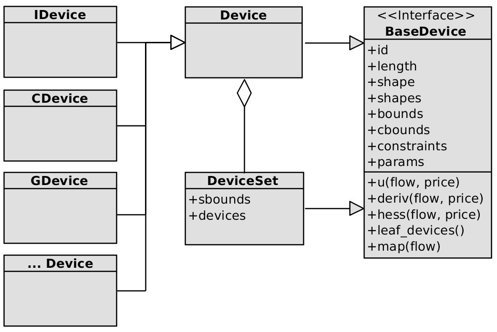

# Device Kit
`device_kit` is a Python package containing a collection of scalar vector flow device models for convex optimal flow simulations. The package defines a common abstract interface for a device, a base set of concrete devices, and a way of constructing new aggregate devices from collection of related sub-devices. Under the hood it's a big 2d numpy array, with discrete time slot along one dimension, and leaf device along the other. `device_kit` makes it easier to express and manage the constraints and cost functions, and solve the system.

The `device_kit` was originally written for the purpose modeling controllable microgrid or household electrical devices, and then optimizing flows over a day-ahead time horizon.

<table>
  <tr>
    <td width="50%" style="vertical-align: top;">
        <figure>
            <a name='f1'></a><br/>
            <small>The core classes of `device_kit`. Most the model complexity is in sub classes of `Device`. A handful of sub-types are provided in this package such as `IDevice`. `DeviceSet` connects a network of devices. </small>
        </figure>
    </td>
    <td width="50%" style="vertical-align: top;">
        <figure>
            <a name='f2'></a><br/>
            <small>Example radial microgrid model-able with `device_kit`.</small>
        </figure>
    </td>
  </tr>
  <tr>
    <td width="50%" style="vertical-align: top;">
        <figure>
            <a name='f3'></a><br/>
            <small>Example microgrid connection home simulation from unoptimized to optimized.</small>
        </figure>
    </td>
    <td width="50%" style="vertical-align: top;">
        <figure>
            <a name='f4'></a><br/>
            <small>Example aircon utility based simulation from unoptimized to optimized. Temperature goes up as cost goes down. Utility curve varies between aircon scenarios.</small>
        </figure>
    </td>
  </tr>
</table>

# Installation

```
pip install "git+https://github.com/sgpinkus/microgrid_device_kit"`
```

# Synopsis
A simple example of using `device_kit` to model a collection of devices and then solve for some constraint over the joint flows - most commonly balanced flows:

```python
import numpy as np
import pandas as pd
import matplotlib.pyplot as plt
import device_kit
from device_kit import *

def random_uncontrolled():
  return np.maximum(0, 0.5+np.cumsum(np.random.uniform(-1,1, 24)))

def generator_cost_curve():
  return np.stack((np.sin(np.linspace(0, np.pi, 24))*0.5+0.1, np.ones(24)*0.001, np.zeros(24)), axis=1)

def make_model():
  ''' Small power network model. '''
  np.random.seed(19)
  model = DeviceSet('site1', [
      Device('uncontrolled', 24, (random_uncontrolled(),)),
      IDevice2('scalable', 24, (0.5, 2), (0, 24), d0=0.3),
      CDevice('shiftable', 24, (0, 2), (12, 24)),
      GDevice('generator', 24, (-10,0), cbounds=None, cost_coeffs=generator_cost_curve()),
      DeviceSet('sub-site1', [
          Device('uncontrolled', 24, (random_uncontrolled(),)),
          SDevice('buffer', 24, (-7, 7), c1=1.0, capacity=70, sustainment=1, efficiency=1)
        ],
        sbounds=(0,10) # max capacity constraint.
      ),
    ],
    sbounds=(0,0) # balanced flow constraint.
  )
  return model

def main():
  model = make_model()
  (x, solve_meta) = device_kit.solve(model, p=0) # Convenience convex solver.
  print(solve_meta.message)
  df = pd.DataFrame.from_dict(dict(model.map(x)), orient='index')
  df.loc['total'] = df.sum()
  pd.set_option('display.float_format', lambda v: '%+0.3f' % (v,),)
  print(df.sort_index())
  print('Utility: ', model.cost(x, p=0))
  df.transpose().plot(drawstyle='steps', grid=True)
  plt.ylabel('Power (kWh)')
  plt.xlabel('Time (H)')
  plt.savefig('synopsis.png');

if __name__ == '__main__':
  main()
```

Gives:

```
Optimization terminated successfully
                                 0      1      2      3      4      5      6      7      8      9      10     11     12     13     14     15     16     17     18     19     20     21     22     23
site1.generator              -3.850 -2.744 -1.964 -1.630 -1.303 -1.455 -0.991 -1.040 -1.084 -1.140 -0.927 -0.770 -0.770 -0.783 -0.808 -0.848 -0.907 -0.991 -1.110 -1.282 -1.542 -1.964 -2.698 -3.249
site1.scalable               +0.991 +0.664 +0.663 +0.551 +0.632 +0.500 +0.664 +0.500 +0.500 +0.500 +0.500 +0.663 +0.663 +0.663 +0.663 +0.663 +0.664 +0.664 +0.664 +0.664 +0.664 +0.663 +0.698 +1.249
site1.shiftable              +2.000 +0.793 +0.696 +0.000 +0.000 +0.000 +0.100 +0.000 +0.000 +0.000 +0.000 +0.108 +0.108 +0.120 +0.145 +0.119 +0.244 +0.327 +0.446 +0.618 +0.878 +1.301 +2.000 +2.000
site1.sub-site1.buffer       +0.128 +0.052 +0.052 +0.026 +0.044 -0.091 +0.052 -0.015 -0.076 -0.138 -0.033 -0.000 -0.000 -0.000 -0.000 -0.000 -0.000 -0.000 -0.000 -0.000 -0.000 -0.000 +0.000 -0.000
site1.sub-site1.uncontrolled +0.730 +1.016 +0.553 +1.054 +0.627 +1.046 +0.176 +0.555 +0.660 +0.767 +0.460 +0.000 +0.000 +0.000 +0.000 +0.066 +0.000 +0.000 +0.000 +0.000 +0.000 +0.000 +0.000 +0.000
site1.uncontrolled           +0.000 +0.218 +0.000 +0.000 +0.000 +0.000 +0.000 +0.000 +0.000 +0.011 +0.000 +0.000 +0.000 +0.000 +0.000 +0.000 +0.000 +0.000 +0.000 +0.000 +0.000 +0.000 +0.000 +0.000
total                        +0.000 +0.000 +0.000 +0.000 +0.000 +0.000 +0.000 +0.000 +0.000 +0.000 +0.000 +0.000 +0.000 +0.000 +0.000 +0.000 +0.000 +0.000 +0.000 +0.000 +0.000 +0.000 +0.000 +0.000
Utility:  -13.021871014972055
```

<table>
  <tr>
    <td width="50%" style="vertical-align: top;">
        <figure>
            <a name='f3'></a><br/>
            <small>Output plot.</small>
        </figure>
    </td>
  </tr>
</table>

# Overview
In the scope of this package, a device is something that consumes and/or produces some kind of scalar valued commodity (ex. electricity, gas, fluid) over a fixed, discrete, and finite future planning/scheduling horizon (ex. every hour of the next day, or every minute of the next hour, etc). For each device what is modeled is simply:

  1. The non-negotiable hard constraints on the commodity *flow* to/from the device.
  2. Costs (or soft constraints) for different feasible states of flow to/from the device.

All the concrete device models provided are currently all weakly convex and tune-able. The concrete set of device implementations can be used to model quite a wide range of scenarios within the bounds of convexity.

Low level devices exist in a network which acts as a conduit for commodity flow between devices (ex. an electrical bus). This package is limited (by design) to modeling radially structured (in other words, *rooted tree* structured) networks to an arbitrary nesting level (the simple flow networks we're interested in modeling have a radial structure or can be treated as such at the level of abstraction we're interested in). "Networks" are implemented as composite devices containing other atomic or composite devices, down to some eventual leaf node device level (<a href="#f2">see figure</a>).

# Implemented Devices

|SHORT NAME|LONG NAME|COST FUNCTION AND CONSTRAINTS|
|-|-|-|
|CDevice|Cummulative Device|Linear with cummulative consumption over time bounds|
|GDevice|Generator Device|Quadractive cost function|
|IDevice|Instantaneous Device|Parametized quadratic section see [here](./docs/instantaneous-device-utility-curve-analysis.md)|
|IDevice2|Alternative Instantaneous Device|Parametized quadratic section see [here](./docs/instantaneous-device-utility-curve-analysis.md)|
|MFDevice|Multiflow Device|Constraints s.t. can take flow from one of two source (ex. heat and electricity) in perfect subs|
|PVDevice|Photo-voltaic Device|Simple model of PV with some surface area and efficiency factor|
|SDevice|Storage Device|Generic battery or thermal storage device with a few parameters|
|TDevice|Thermal Device|Does a thing|
|ADevice|Any Device|Takes an arbitrary cost function and constraints|
|...|Other Device|Experimental|

# Class Structure
There is two important classes: `Device` and `DeviceSet`. The UML class diagram in the <a href="#f1">figure</a> shows how they are related. All devices sub-class `BaseDevice` which is the key abstract representation of a device. A device's consumption/production/both, herein called *flow*, is a 2D `R` by `C` numpy array. For "atomic" devices of class `Device`, `R` is always 1, and `C` is the fixed length (`__len__`) of the Device. A collection of devices is also implemented as a sub-type of `BaseDevice` and this is how `R` can be greater than 1. The `DeviceSet` class is used to represent collections of devices, such as a network or sub-network. `DeviceSet` allows devices to be organized into an arbitrarily deep rooted tree of devices. An example is shown in the figure. Atomic device always occur at the leaves. All internal nodes, and the root of the tree are `DeviceSet` instances.

All devices are intended to be stateless: they are not actively consuming producing anything. Rather they are modeling the preferences and constraints for the flow of a commodity (the `map(flow)` method shown in the UML diagram allows you to map an actual flow matrix onto a collection of devices). Devices are also intended to be immutable (but technically they are not currently strictly immutable).

# Flexibility Modeling Details
Device's encapsulate a flexibility model. Flexibility has two components *preferences* or soft constraints and (hard) *constraints*.

For convenience, the `Device` base class provides for two very common rudimentary baked-in constraints:

  - `Device.bounds` for *interval* (also called instantaneous) bounds for each given interval of the time-horizon and,
  - `Device.cbounds` for *cumulative* bounds across the entire time-horizon.

Preferences are expressed via the `Device.cost(flow)` function which expresses how much the device "likes" the given state of flow (note utility = -cost). The `Device` base class has no preferences: `Device.cost()` just returns 0. It is the main job of a `Device` sub-type to define preferences and/or additional more complex constraints that describe more nuanced device models. sub-types do this by overriding `Device.cost()` (preferences) and `Device.constraints` (constraints).
